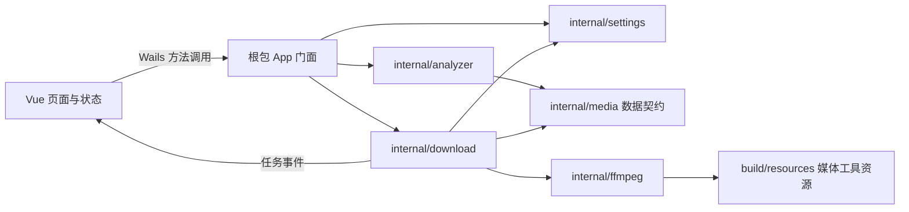

# 项目架构审查与骨架说明

## 审查结论

初始仓库是 Wails 官方 Vue 起始模板。经过本次骨架整理后，现状为：

- `main.go` 负责启动 Wails、嵌入前端资源并绑定根包 `App`，适合继续作为桌面入口。
- `app.go` 只保存 Wails 生命周期 context；Greet 示例已移除，业务 API 尚未接入。
- `frontend/src/App.vue` 是无业务调用的 VideoDL 交互骨架；分析按钮保持禁用，避免呈现虚假的可用功能。
- `frontend/wailsjs` 是 Wails 生成的绑定与运行时，生成文件不应手工维护；现存的 Greet 绑定是旧生成物，添加真实 API 时由 Wails CLI 更新。
- 没有分析、下载、任务、设置或 FFmpeg/FFprobe 的实现。
- Go 数据契约已在 `internal/media/model.go` 建立；计划中的其余模块尚未创建。
- 产品说明、架构说明、任务计划和 TRAE 单任务交接指引已建立。

## 目标依赖关系

Go 业务包不依赖 Vue 或 Wails runtime；只有根包 `App` 处理 Wails 方法、系统对话框和事件。前端传分析 ID/候选 ID，不传任意媒体 URL 作为下载命令。分析器必须在请求时执行公网地址校验；FFmpeg 也要限制协议及重定向访问，避免由清单中的子资源绕过检查。

## yt-dlp 网站解析链路

默认分析链路为 `App → AnalysisService → yt-dlp standalone → restricted proxy → JSON mapping`。yt-dlp 只负责站点识别和格式解析；候选结果只包含不透明 ID、脱敏展示地址和媒体元数据，真实短期 URL/请求头保存在后端分析会话中。

下载任务开始时，Go 按候选/变体 ID 重新调用 yt-dlp 获取最新 URL，再将一个或多个 HTTP(S) 输入交给 FFmpeg。这样既支持音视频分离格式，也避免把易过期签名 URL 暴露给前端。失败、取消和应用退出都通过 context 回收代理与子进程。

yt-dlp 资源固定放在 `resources/yt-dlp/tools/<platform>/`，用户更新副本放在用户配置目录；两个位置都由显式解析器查找，绝不回退到系统 PATH。默认设置 `--ignore-config`、`--no-cookies-from-browser` 和 `YTDLP_NO_PLUGINS=1`。浏览器 Cookie 只在 Wails 的显式授权 API 中按 allowlist 读取。

新增 Wails API：`GetYTDLPStatus`、`UpdateYTDLP`、`AnalyzeWithBrowserSession`。前端只发送网页 URL、浏览器名称和可选 profile 名称，不发送 Cookie、Cookie 文件路径、媒体 URL 或任意 yt-dlp 参数。

## 目标目录职责

| 路径 | 职责 | 当前状态 |
|---|---|---|
| `main.go` | Wails 启动、资源嵌入、绑定 `App` | 已保留并调整窗口标题/背景 |
| `app.go` | `App` 生命周期与 Wails 边界 | 生命周期骨架；业务 API 待接入 |
| `internal/media` | 前后端共享的领域数据结构和枚举 | 已建立数据模型 |
| `internal/analyzer` | URL 安全请求、HTML/清单解析、候选探测 | 待任务 7–10 |
| `internal/download` | 任务状态机、并发、取消/重试、输出发布 | 待任务 11–14 |
| `internal/ffmpeg` | 工具定位、版本检查、参数、进程/进度解析 | 待任务 4–6、12、14 |
| `internal/settings` | 默认下载目录及应用设置 | 待任务 3 |
| `frontend/src/features/analyze` | URL 输入、分析状态和媒体候选 UI | 待任务 16；当前页面只有静态入口 |
| `frontend/src/features/downloads` | 下载任务列表和操作 | 待任务 17 |
| `frontend/src/shared` | Wails API 封装、共享类型与通用 UI | 待任务 15–17 |
| `build/resources/ffmpeg` | 各发布目标对应的 FFmpeg/FFprobe、哈希清单与许可材料 | 任务 4 已锁定来源；任务 18 接入 Wails 平台资源布局 |
| `docs` | 产品约束、架构、计划和 TRAE 执行说明 | 已建立 |

目录在开始对应任务时再创建，不预建空包。当前只建立被模型契约直接需要的 `internal/media`。

## 核心数据与 API 契约

`internal/media/model.go` 是 Go 侧共享模型的唯一来源。`DisplayURL` 只用于展示且必须剥除签名 query/fragment；下载始终由后端按分析会话中的候选 ID 查找原始地址。Wails 方法使用这些公开类型，前端绑定由 Wails 生成；不要在 Vue 中手写重复定义后让字段漂移。

计划中的 Wails 门面方法：

| 方法 | 输入 | 返回/作用 |
|---|---|---|
| `AnalyzeURL(url string)` | 网页 URL | `media.AnalysisResult`，候选项由后端生成不透明 ID |
| `StartDownload(request media.DownloadRequest)` | analysis ID、media ID、variant ID、输出路径、预设 | `media.DownloadTask` |
| `CancelDownload(taskID string)` | 任务 ID | 取消对应任务 |
| `RetryDownload(taskID string)` | 任务 ID | 创建新尝试并返回任务快照 |
| `ChooseDownloadDirectory()` | 无 | 打开原生目录选择框并返回选择结果 |
| `SetDownloadDirectory(path string)` | 用户选择的路径 | 校验并保存默认目录 |
| `OpenFile(taskID string)` / `OpenFolder(taskID string)` | 已完成任务 ID | 后端从已完成任务读取输出路径，再通过本机系统能力打开，前端不传任意本地路径 |

任务事件负载复用 `media.DownloadTask` 快照或其明确版本化的等价结构。进度未知时省略/置空；错误码稳定、错误文案可本地化。取消不应被报告成失败。

## 关键架构决策

- **根包保留 Wails 接入。** Wails 绑定稳定地使用 `main.App`，Go 业务实现放在 `internal`，避免把 Wails runtime 扩散到各模块。
- **分析会话持有真实源 URL。** 前端通过不透明 ID 指定候选/变体；后端从有限期分析会话解析源 URL，并在下载前再次校验目标地址。
- **媒体工具由后端进程调用。** 参数数组启动，机器可读进度，固定配置式转码预设；不允许任意命令字符串。
- **分析代理分两层。** `netguard` 先校验公网目标，再可通过环境中的 HTTP 上游代理转发；上游代理地址本身不改变目标校验边界。
- **先做静态网页/公开清单。** MVP 不运行任意网页 JavaScript；动态页面作为明确“不支持”结果，后续根据实际需求再扩充。
- **按任务创建目录。** 避免为尚未实现的功能创建空包和空抽象；每个计划任务在开始时新增最少文件。

## 关键安全边界

- URL 校验覆盖首个请求、重定向、HLS/DASH 子资源及 FFmpeg 重定向；只验证页面 URL 不足以保护本机网络。
- DNS 校验应绑定到实际连接过程，避免先解析校验、随后重新解析连接的 DNS rebinding 间隙。
- 生成输出文件名时清理路径分隔符、控制字符和平台保留名；最终写入前校验目标目录和重名决策。
- 任务取消要结束对应进程和后代进程；应用退出也要有明确清理策略。
- 日志、错误和 UI 显示对带签名 URL 的 query 参数脱敏；不要持久化会话源 URL。

## 暂不固化的技术决定

以下事项在对应任务中以可复现的目标平台验证后再选定，不提前添加依赖或构建系统：

- macOS/Windows 的 FFmpeg/FFprobe 发布资源切换为 serversideup `v8.1.2-27` LGPL-only 构建，并要求包含 `https` 与 `tls` 协议；Linux 仍保留旧资源，暂不在本次验证范围。构建选项、平台归档 SHA-256 和许可证材料见 `build/resources/ffmpeg/manifest.yaml` 与 `CREDITS.md`。
- 媒体工具放入 Wails 资源的确切目录与平台打包注入方式（任务 18）。
- 前端状态管理库、路由和组件库（只有原生 Vue 状态无法满足时再引入）。
- Linux ARM64 是否进入首发矩阵（当前产品说明列为后续扩展）。
